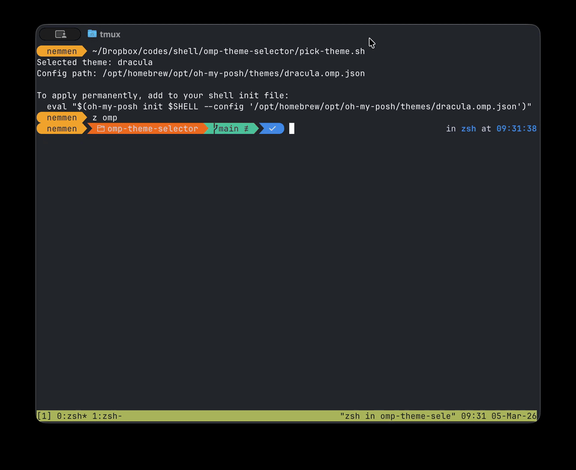

# omp-theme-selector

Interactive [oh-my-posh](https://ohmyposh.dev/) theme picker with live preview in the terminal.

<!-- TODO: replace with a GIF demo -->


## Features

- Browse all installed themes by name in an fzf picker
- Live preview of each theme rendered at the bottom of the terminal
- Blinking cursor showing exactly where the prompt ends
- Works with Homebrew, curl installer, and custom theme directories

## Requirements

- [oh-my-posh](https://ohmyposh.dev/docs/installation/linux)
- [fzf](https://github.com/junegunn/fzf)

## Installation

### One-liner (recommended)

```bash
curl -fsSL https://raw.githubusercontent.com/rsnemmen/omp-theme-selector/main/install.sh | bash
```

This downloads `omp-theme` to `~/.local/bin` (or `/usr/local/bin`) and makes it executable.
To install to a custom location, set `INSTALL_DIR`:

```bash
curl -fsSL https://raw.githubusercontent.com/rsnemmen/omp-theme-selector/main/install.sh | INSTALL_DIR=~/bin bash
```

### Manual

```bash
curl -fsSL https://raw.githubusercontent.com/rsnemmen/omp-theme-selector/main/omp-theme.sh \
  -o ~/.local/bin/omp-theme
chmod +x ~/.local/bin/omp-theme
```

### From source

```bash
git clone https://github.com/rsnemmen/omp-theme-selector
cd omp-theme-selector
cp omp-theme.sh ~/.local/bin/omp-theme
chmod +x ~/.local/bin/omp-theme
```

## Usage

```bash
omp-theme
```

Use `↑`/`↓` to browse themes and see them previewed instantly. Press `Enter` to select.

On selection the script prints the config path and the line to add to your shell init file:

```
Selected theme: agnoster
Config path: /opt/homebrew/opt/oh-my-posh/themes/agnoster.omp.json

To apply permanently, add to your shell init file:
  eval "$(oh-my-posh init $SHELL --config '/opt/homebrew/opt/oh-my-posh/themes/agnoster.omp.json')"
```

## Theme directory detection

The script looks for themes in this order:

1. `~/.poshthemes/` — custom/user-managed themes
2. `$(oh-my-posh cache path)/themes` — curl installer (Linux & macOS)
3. `$(brew --prefix oh-my-posh)/themes` — Homebrew (macOS)
